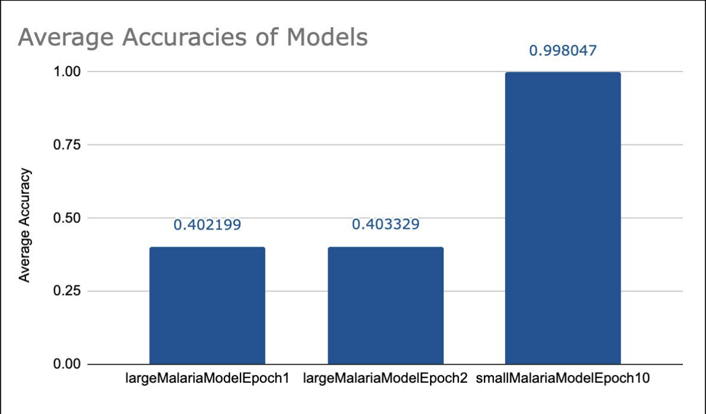

## Introduction
Our model in Quarter 1 focused on leveraging unsupervised machine learning to predict
genetic variation in DNA sequences. By applying natural language processing techniques,
particularly transformer-based models like DNA-BERT, we aimed to identify significant motifs and potential mutations in genomic data. This approach provided valuable insights into
how sequence variations can influence biological function, paving the way for computational methods to detect and interpret genetic anomalies efficiently. However, while our
previous work primarily explored DNA motif detection in a broad genomic context, we now
shift our focus toward a more impactful application—predicting mutations in the malaria
parasite, which is known to develop resistance to antimalarial drugs through genetic mutations.
Building on our previous experience with transformer models, our current project investigates the predictability of sequencing and mutations in P. falciparum using a BERT-based
model. We want to assess how well these models can forecast genomic sequences and detect
potential mutations, particularly in regions associated with drug resistance. By preprocessing the reference genome of the P. falciparum 3D7 strain, segmenting it into fixed-length
k-mers, and analyzing nucleotide composition, k-mer frequency, and GC content, we establish a structured dataset for transformer-based learning. Additionally, we compare our
model’s performance to DNABERT, a transformer model pre-trained on human DNA, to
evaluate its effectiveness in capturing genomic patterns in malaria.
Our project extends the foundational concepts from our Quarter 1 research, transitioning
from general genetic variation analysis to a real-world application in infectious disease genomics. By applying machine learning to malaria genomics, we hope to contribute to the
early identification of mutations linked to drug resistance, ultimately aiding global efforts
in combating malaria through improved surveillance and treatment strategies.

## Methods

### Dataset
The dataset used in this study was provided by the **Winzeler Lab at UC San Diego**, which
specializes in malaria genomics research. The primary dataset consists of the **reference
genome of Plasmodium falciparum 3D7**, sourced from **PlasmoDB v13**. The reference
genome is approximately **23 million bases in size** and includes **14 nuclear chromosomes**,
as well as **mitochondrial and apicoplast sequences.** This dataset serves as the foundation
for training a transformer-based model to analyze and predict genetic mutations associated
with drug resistance.

In addition to the reference genome, the resistome dataset maintained by the Winzeler Lab
contains around 1,500 whole-genome sequencing (WGS) samples of P. falciparum parasites that were experimentally evolved to develop drug resistance. Within these samples,
approximately 850 mutations (300 unique alleles) have been either manually validated or statistically inferred to contribute to resistance phenotypes. While the resistome dataset is
useful for evaluating the model’s ability to identify drug resistance-associated mutations,
the training process primarily relies on the reference genome sequences.

To maintain data integrity and enhance model performance, the dataset was processed
through a structured preprocessing pipeline. The reference genome FASTA file was parsed
into a structured format, where each chromosome was extracted and stored as a separate
entry. To accommodate the transformer model’s input constraints, each chromosome sequence was segmented into 512-base-long chunks. This allows the model to learn patterns
within manageable subsequences of the genome while maintaining biological relevance.
Any redundant or improperly formatted sequences were filtered out to prevent data leakage
and redundancy in training. Additional genomic features such as nucleotide composition,
k-mer frequency (3-mers), and GC content were computed for each chunk to analyze the
statistical properties of the dataset.

<em>Figure 1: Preview of Genomic Dataset</em>

The processed dataset provides a structured input for training the BERT-based language
model, enabling it to learn the contextual relationships between nucleotide sequences. Future iterations of the project may explore training on additional Plasmodium species or
incorporating resistance-associated mutations and using classification methods to further
refine predictive performance.

### Model Architechture
To predict mutations in Plasmodium falciparum and analyze genomic sequences, we implemented a custom BERT-based transformer model tailored for DNA sequence processing. The model is designed to leverage self-attention mechanisms and contextual embeddings to identify patterns within malaria genomic data. Below, we provide an overview of the
core components and their roles in the architecture.

Our model builds on the Bidirectional Encoder Representations from Transformers (BERT) architecture, which has proven effective in NLP and has been adapted for genomic data. The main components of our custom Context-Guided BERT architecture are as follows:

1\. Embedding layers  
2\. Multi-Head Self-Attention Mechanism  
3\. Feed-Forward Layers  

To convert raw DNA sequences into a numerical format suitable for transformer processing,
we use 3 types of embeddings which form the input representation fed into the transformer
model.

• Token Embeddings - Each nucleotide (A, T, C, G) is mapped to a unique index in the
vocabulary, similar to word embeddings in NLP.  
• Positional Embeddings - Since transformers lack inherent sequence order, we incorporate sinusoidal position encodings to retain positional information.  
• Segment Embeddings - To help distinguish between different sequence chunks when
training on paired sequences.  

### Training and Fine-Tuning
The model is trained using negative log-likelihood loss (NLLLoss) for both the MLM (Masked Learning Model) and
NSP (Next Sentence Prediction) tasks.

<em>Figure 2: BERT Based MLM Pipeline</em>

### Correlation between mutations and drug resistance

## Results
We trained several models, a selection of which can be seen in the table. Our models that are labeled as being large were trained off approximately 80% of our training data, approximately 36000 pieces of data while the small models were trained for fewer epochs from 2000 pieces of data. We were able to achieve a 40% accuracy with our large models and a 99% accuracy with our small model.

<em>Figure 3: Comparison of Model Accuracy</em>

Each of these models have the ability to produce a series of probabilities that represent the likelihood of a nucleotide for each position in a sequence. By grabbing the maximum probability for each position, we get a prediction for what nucleotide we think should occupy that position. In the case shown by the figures below, for positions 20-29 of the sequence we predict the input sequence to be \"CCCCCCAAAC\". 

  

<em>Figure 4: Sequence Prediction</em>

## Conclusion/Discussion
Drug resistance in malaria, specifically in the species Plasmodium falciparum which we attempted to analyze through this experiment, has exploded in recent decades leading to a resurgence of malaria and millions of deaths, especially in children. This can largely be attributed to not only an overuse of medication, but more importantly for this study, genetic mutation.

By attempting to create a model that can learn what, at a baseline, malaria should look like, we hope that we can pinpoint if new specimens of Plasmodium falciparum are drug resistant. This is done by seeing how accurately the model can guess what the new sequence should look like, having been trained off of the current idea of Plasmodium falciparum, with low accuracy predictions possibly corresponding to DNA mutations that cause drug resistance. Additionally, since the model makes a prediction at each nucleotide position, the model may even be able to pinpoint where the DNA sequence has mutated.

In the future, we hope that this can mean that we are not only able to detect mutations in malaria sooner, thereby starting new drug and medication research earlier, we can also get a better idea of how medication needs to change through locating where in a sequence of DNA has low predictability, thereby locating where the DNA has likely changed and what about the DNA sequence may be causing higher drug resistance. 

For example, Patrick G Bray et al. in “Defining the role of PfCRT in Plasmodium falciparum chloroquine resistance” discusses how a specific protein leads to resistance of chloroquine, a common drug that was used in antimalarial medication. It is our hope that our model would be able to track changes in this protein and other proteins present, to get a better understanding of how and why drug resistance may be rising in malaria and how researchers may need to change current antimalarial medication to better target this new form of malaria. 

Additionally, although we trained our model off of Malaria data, this model can be trained off of any type of data which means it may be able to fine-tune to other types of diseases. In the end, by calculating accuracy and by extension the predictability of new DNA sequences we hope that our model will be able to decrease the amount of time it takes to create new effective medication for malaria, thereby decreasing the amount of deaths caused by malaria.

## Limitations & Future Work
While our model shows promise in identifying drug resistance-related mutations, there are still a few challenges to address.

One key limitation is that our model is trained primarily on the P. falciparum 3D7 strain, which means it might not work as well on malaria strains from different regions. To improve generalization, future versions should incorporate multi-strain datasets, making the model more adaptable to real-world genetic diversity. Another challenge is that we’re using sequence predictability as a stand-in for mutation detection. While our results suggest that lower confidence predictions align with drug resistance mutations, this doesn’t necessarily prove causation. To confirm whether these mutations actually cause resistance, we’d need additional experimental validation, such as lab tests or protein structure analysis.

Computational demands also played a role—training on full-genome datasets is resource-intensive, even with a BERT-based transformer architecture. Future work could explore lighter models, such as using model distillation or combining transformers with CNNs, to balance efficiency and accuracy.

Beyond malaria, this model could be fine-tuned for other pathogens, including viruses and bacteria, expanding its role in infectious disease research. Additionally, incorporating biological and epidemiological data, like patient treatment outcomes or geographic resistance patterns, could improve the model’s ability to track and predict drug-resistant strains in real-world settings. By tackling these limitations, we hope to refine our approach, improve global malaria surveillance, and ultimately help in the fight against drug-resistant infections.

## References
[1] Malaria Facts & Statistics | Medicines for Malaria Venture. MMV: Medicines for Malaria Venture. (n.d.). https://www.mmv.org/malaria/malaria-facts-statistics 

[2] Murray, C. J., Rosenfeld, L. C., Lim, S. S., et al. Global malaria mortality between 1980 and 2010: A systematic analysis - the lancet. The Lancet. https://www.thelancet.com/journals/lancet/article/PIIS0140-6736(12)60034-8/fulltext

[3] Fidock, D. A. (n.d.). Defining the role of PfCRT in Plasmodium falciparum chloroquine resistance. PubMed. Retrieved March 9, 2025, from https://pubmed.ncbi.nlm.nih.gov/15813727/
